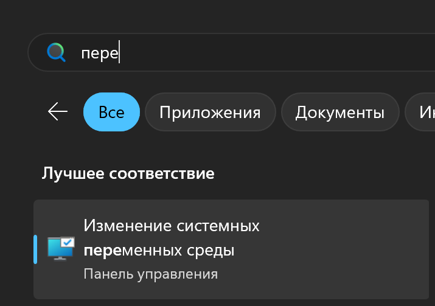
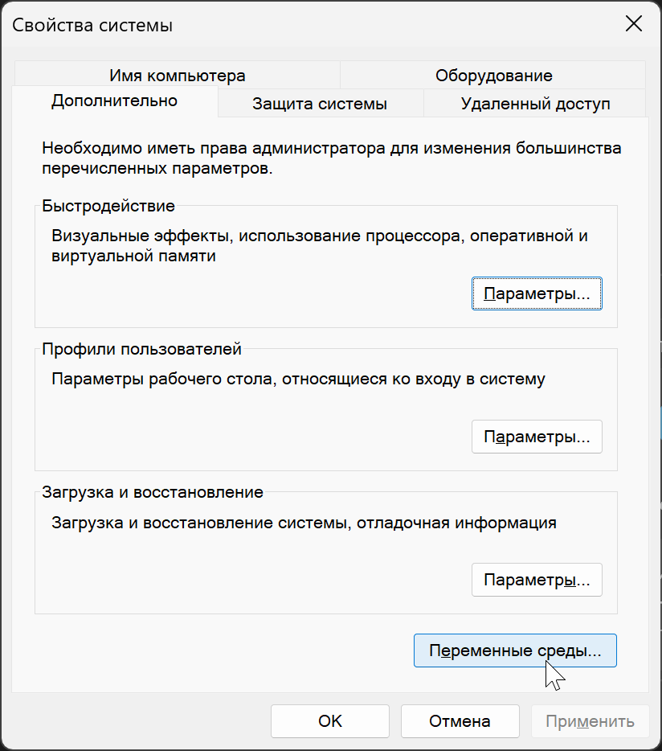
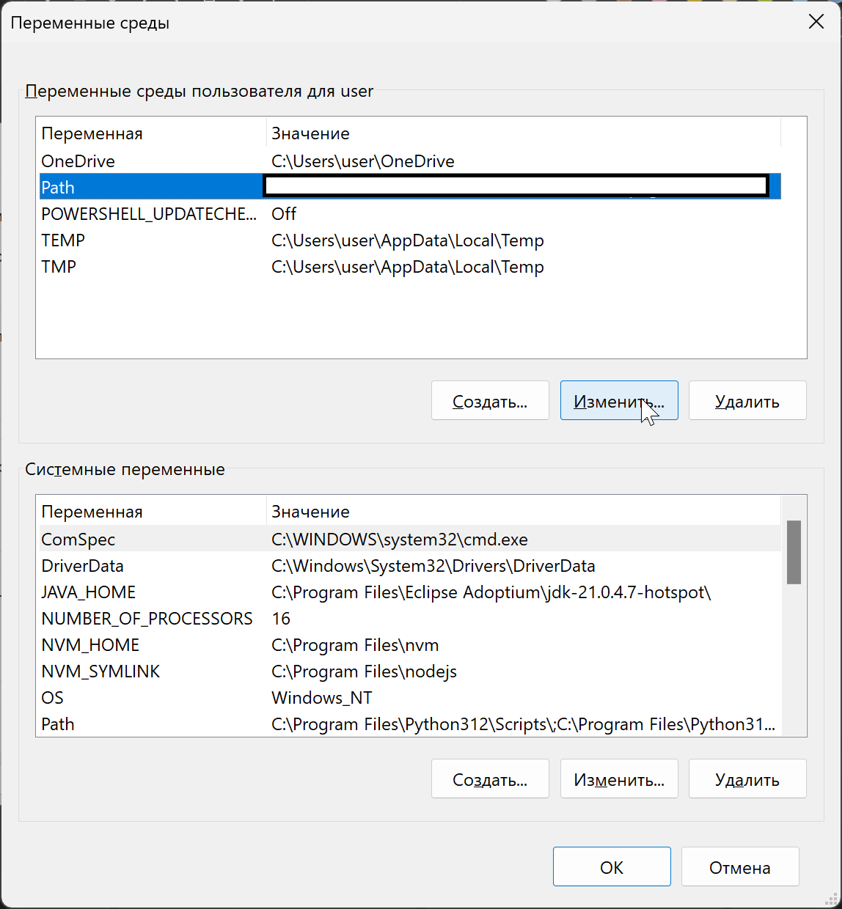
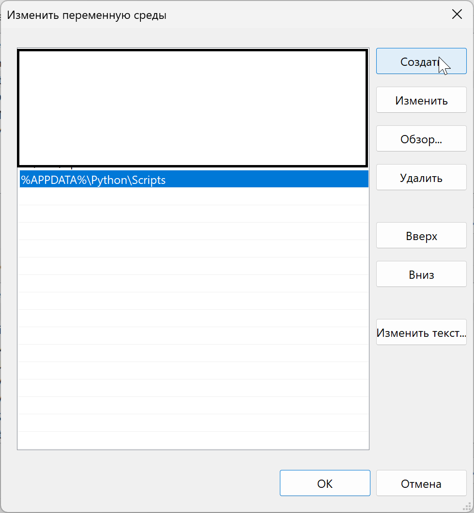

## Окружение и примеры для выполнения лабораторных работ по дисциплине "Методы ИИ"

### Python

Используется Python версии 3.12

Установщик https://www.python.org/ftp/python/3.12.5/python-3.12.5-amd64.exe

### Poetry

Для создания и настройки окружения проекта необходимо установить poetry

**Для Windows (Powershell)**

```
(Invoke-WebRequest -Uri https://install.python-poetry.org -UseBasicParsing).Content | python -
```

**Linux, macOS, Windows (WSL)**

```
curl -sSL https://install.python-poetry.org | python3 -
```

**Добавление poetry в PATH**

1. Открыть настройки переменных среды \
    \
    \
    \
    \
   
2. Изменить переменную Path текущего пользователя \
    \
    \
   
3. Добавление пути `%APPDATA%\Python\Scripts` до исполняемого файла poetry \
    \
   

### Создание окружения

```
poetry install --no-root
```
